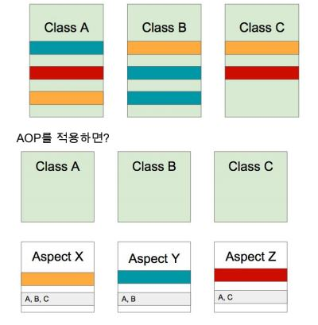
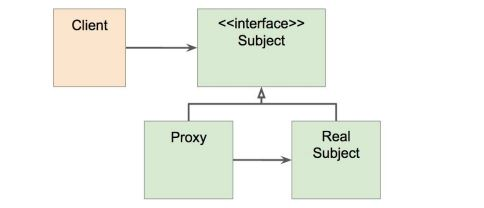

# 스프링 AOP

Aspect-oriented-programming(AOP)은 OOP를 보완하는 수단으로, 흩어진 Aspect를  모듈화 할 수 있는 프로그래밍 기법





AOP를 사진으로 설명하면 각각의 Class에 있는 꼭 필요한 Aspect를 모아서 모듈화 하여 정리해놓고 사용하는 것이다. 코드에 직접 쓰지 않고 영향을 주는 것이다. 예를 들면 Transaction, logging이 있다. 

* Transaction
  * 보통 transaction처리는 set auto commit을 false로 만들고 쿼리를 만들어서 실행하고 commit을 하거나 rollback을 한다. 기존의 서비스 코드를 모두 감싸야한다.
* Logging
  * 어떤 성능을 테스트하는 logging을 모듈화 해놓고 테스트 하고자 하는 성능에 사용하면 된다.


해야할일과 그일을 어디에 적용해야하는지를 모듈화하는것이 AOP이다.


#### AOP 주요개념

* Aspect와 Target(적용되는 대상)
* Advice(해야할 일)
* Join point(끼어들수 있는 지점, 합류 지점)와 Pointcut(어디에 적용해야하는지)


#### AOP 적용방법

* 컴파일 타임
  * Java -> class파일로 만들때  이미 조작된 바이트 코드를 생성하는것
* 로딩 타임
  * class를 로딩하는 시점에서  class바이트 코드는 그대로 있지만 로딩했을때는 JVM메모리상에는 끼워져 있다.

* 런타임
  * 스프링 AOP가 하는 방법, A라는 Class의 Bean을 만들때 A라는 타입을 감싼 Proxy빈을 만든다. 
  * 최초의 Bean을 만들때 부가 비용이 들어간다.
  * 문법이 간단하다.(적용이 쉽다)


#### AOP 구현체

* Java
  * Spring AOP
  * AspectJ


# 프록시 기반 AOP

#### 스프링 AOP 특징

* 프록시 기반의 AOP 구현체
* 스프링 빈에만 AOP를 적용할 수 있다.
* 모든  AOP기능을 제공하는것이 목적이 아니라.  스프링 IoC와 연동하여 엔터프라이즈 애플리케이션에서 가장 흔한 문제에 대한 해결책을 제공하는 것이 목적


#### 프록시 패턴

* 기존의 코드 변경없이 접근 제어 또는 부가 기능 추가



문제점

* 매번 프록시 클래스를 작성해야 하는가?
* 여러 클래스 여러 메소드에 적용하려면?
* 객체들 관계가 복잡하다.


그래서 등장한 것이 스프링 AOP

* 스프링 IoC 컨테이너가 제공하는 기반 시설과 Dynamic(동적) 프록시를 사용하여 여러 복잡한 문제 해결
* 동적 프록시
  * 동적으로 프록시 객체를 생성하는 방법
  * 자바가 제공하는 방법은 인터페이스 기반 프록시 생성
  * CGlib은 클래스 기반 프록시도 지원
* 스프링 IoC
  * 기본 빈을 대체하는 동적 프록시 빈을 만들어 등록 시켜준다.
  * 클라이언트 코드 변경 없음
  * AbstractAutoProxyCreator implements BeanPostProcessor


# @AOP

애노테이션 기반 스프링 @AOP


공부한 git 주소

 https://github.com/rlaguswhd19/Spring_study/tree/master/AOP 


의존성 추가

```xml
<dependency> 
	<groupId>org.springframework.boot</groupId> 
	<artifactId>spring-boot-starter-aop</artifactId> 
</dependency> 

```


#### Aspect 정의

* @Aspect
* 빈으로 등록해야 하니까  @Component 추가


애노테이션 기반 AOP

애노테이션을 하나 만든다.

```java
@Documented
// 애노테이션을 얼마나 유지할것인지?
@Retention(RetentionPolicy.CLASS)
// Target은 메소드
@Target(ElementType.METHOD)
public @interface PerfLogging {

}
```


그다음 적용할 곳에 애노테이션을 붙여주면 된다.

```java
@Around("@annotation(PerfLogging)")
public void hell() {
	System.out.println("hello");
}
```


이렇게 bean으로 설정하면 bean의 모든 public 메소드에 적용이된다.

```java
@Around("bean(simpleEventService)")
public Object logPerf(ProceedingJoinPoint pjp) throws Throwable {
	long begin = System.currentTimeMillis();
		
	//대상의 method가 실행
	Object retVal = pjp.proceed();
		
	System.out.println(System.currentTimeMillis()-begin);
	return retVal;
}
```


#### PointCut 정의

* 주요 표현식
  * execution
  * @annotation
  * bean
* 포인트컷 조합
  * &&, ||, !


#### Advice 정의

* @Before (이전) : 어드바이스 타겟 메소드가 호출되기 전에 어드바이스 기능을 수행
* @After (이후) : 타겟 메소드의 결과에 관계없이(즉 성공, 예외 관계없이) 타겟 메소드가 완료 되면 어드바이스 기능을 수행
* @AfterReturning (정상적 반환 이후)타겟 메소드가 성공적으로 결과값을 반환 후에 어드바이스 기능을 수행
* @AfterThrowing (예외 발생 이후) : 타겟 메소드가 수행 중 예외를 던지게 되면 어드바이스 기능을 수행
* @Around (메소드 실행 전후) : 어드바이스가 타겟 메소드를 감싸서 타겟 메소드 호출전과 후에 어드바이스 기능을 수행


참고

https://docs.spring.io/spring/docs/current/spring-framework-reference/core.html#aop-pointcuts 

