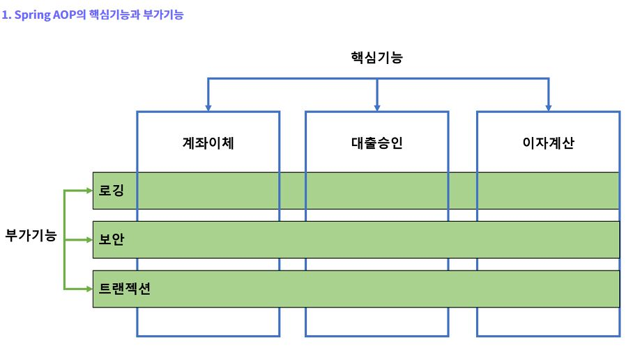

# 스프링 AOP2

#### AOP

* 업무 로직을 포함하는 기능을 **핵심 기능(Core Concerns)**

- 핵심 기능을 도와주는 부가적인 기능(로깅, 보안)을 **부가기능(Cross-cutting Concerns)** 이라고 부른다.

객체지향의 기본원칙을 적용하여도 핵심기능에서 부가기능을 분리해서 모듈화하는 것은 매우 어렵다. AOP는 애플리케이션에서의 관심사의 분리(기능의 분리), 핵심적인 기능에서 부가적인 기능을 분리한다. 분리한 부가기능을 에스펙트(Aspect)라는 독특한 모듈형태로 만들어서 설계하고 개발하는 방법이다.

* OOP를 적용해도 핵심기능에서 부가기능을 쉽게 분리된 모듈로 작성하기 어려운 문제점을 AOP가 해결해 준다고 볼 수 있다.
* AOP는 부가기능을 에스펙트(Aspect)로 정의하여, 핵심기능에서 부가기능을 분리함으로써 핵심기능을 설계하고 구현할 때 객체지향적인 가치를 지킬수 있도록 도와주는 개념이다.

#### Aspect

* Aspect는 부가기능을 정의한는 코드인 Advice와 어디에 적용할지를 결정하는  PointCut을 합친 개념이다.
* AOP 개념을 적용하면 핵심기능 코드 사이에 침투된 부가기능을 독립적인 Aspect로 구분해 낼 수 있다.
* 구분된 부가기능 Aspect를 런타임 시에 필요한 위치에 동적으로 부여할 수 있다. 

#### AOP 용어 정리

**타겟(Target)**

- 핵심 기능을 담고 있는 모듈로 타겟은 부가기능을 부여할 대상이 된다.

**어드바이스(Advice)**

- 어드바이스는 타겟에 제공할 부가기능을 담고 있는 모듈이다.

**조인포인트(Join Point)**

- 어드바이스가 적용될 수 있는 위치를 말한다.

- 타겟 객체가 구현한 인터페이스의 모든 메서드는 조인 포인트가 된다.

**포인트 컷(Pointcut)**

\- 어드바이스를 적용할 타겟의 메서드를 선별하는 정규표현식이다.

\- 포인트컷 표현식은 execution으로 시작하고 메서드의 Signature를 비교하는 방법을 주로 이용한다.

**애스펙트(Aspect)**

* 애스펙트는 AOP의 기본 모듈이다.

- 애스펙트 = 어드바이스 + 포인트컷

- 애스펙트는 싱글톤 형태의 객체로 존재한다.

##### 어드바이저(Advisor)

- 어드바이저 = 어드바이스 + 포인트컷

- 어드바이저는 Spring AOP에서만 사용되는 특별한 용어이다.

**위빙(Weaving)**

* 위빙은 포인트컷에 의해서 결정된 타겟의 조인 포인트에 부가기능(어드바이스)를 삽입하는 과정을 뜻한다.

- 위빙은 AOP가 핵심기능(타겟)의 코드에 영향을 주지 않으면서 필요한 부가기능(어드바이스)를 추가할 수 있도록 해주는 핵심적인 처리과정이다.

#### Spring AOP 특징

**1. Spring은 프록시 기반 AOP를 지원한다.**

\- Spring은 타겟(target) 객체에 대한 프록시를 만들어 제공한다.

\- 타겟을 감싸는 프록시는 실행시간(Runtime)에 생성된다.

\- 프록시는 어드바이스를 타겟 객체에 적용하면서 생성되는 객체이다.

**2. 프록시(Proxy)가 호출을 가로챈다(Intercept)**

\- 프록시는 타겟 객체에 대한 호출을 가로챈 다음 어드바이스의 부가기능 로직을 수행하고 난 후에 타겟의

핵심기능 로직을 호출한다.(전처리 어드바이스)

\- 또는 타겟의 핵심기능 로직 메서드를 호출한 후에 부가기능(어드바이스)을 수행하는 경우도 있다.(후처리 어드바이스)

**3. Spring AOP는 메서드 조인 포인트만 지원한다.**

\- Spring은 동적 프록시를 기반으로 AOP를 구현하므로 메서드 조인 포인트만 지원한다.

\- 핵심기능(타겟)의 메서드가 호출되는 런타임 시점에만 부가기능(어드바이스)을 적용할 수 있다.

\- 반면에 AspectJ 같은 고급 AOP 프레임워크를 사용하면 객체의 생성, 필드값의 조회와 조작,

static 메서드 호출 및 초기화 등의 다양한 작업에 부가기능을 적용 할 수 있다.

#### Spring AOP의 구현방식

**1. XML 기반의 POJO 클래스를 이용한 AOP 구현**

\- 부가기능을 제공하는 Advice 클래스를 작성한다.

\- XML 설정 파일에 <aop:config>를 이용해서 애스펙트를 설정한다.

(즉, 어드바이스와 포인트컷을 설정함)

**2. @Aspect 어노테이션을 이용한 AOP 구현**

\- @Aspect 어노테이션을 이용해서 부가기능을 제공하는 Aspect 클래스를 작성한다.

\- 이 때 Aspect 클래스는 어드바이스를 구현하는 메서드와 포인트컷을 포함한다.

\- XML 설정 파일에 <aop:aspectj-autoproxy />를 설정한다.

#### Advice 종류

**Around 어드바이스**

타겟의 메서드가 호출되기 이전(before) 시점과 이후 (after) 시점에 모두 처리해야 할 필요가 잇는

부가기능을 정의한다.

-> Joinpoint 앞과 뒤에서 실행되는 Advice

**Before 어드바이스**

타겟의 메서드가 실행되기 이전(before) 시점에 처리해야 할 필요가 있는 부가기능을 정의한다.

-> Jointpoint 앞에서 실행되는 Advice

**After Returning 어드바이스**

타겟의 메서드가 정상적으로 실행된 이후(after) 시점에 처리해야 할 필요가 있는 부가기능을 정의한다.

-> Jointpoint 메서드 호출이 정상적으로 종료된 뒤에 실행되는 Advice

**After Throwing 어드바이스**

타겟의 메서드가 예외를 발생된 이후(after) 시점에 처리해야 할 필요가 있는 부가기능을 정의한다.

-> 예외가 던져 질때 실행되는 Advice

