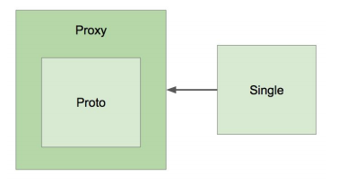

github 공부 내용

 https://github.com/rlaguswhd19/Spring_study 


# 스프링IoC컨테이너

-   Inversion of Control : 의존관계주입(Dependency Injection)이라고도 한다. 객체를 직접 만들어서 사용하는 것이 아니라 컨테이너에서 주입받아 사용한다.
-   IoC기능을 담고 있는 컨테이너(Bean을 담고 있다) = Bean들을 컨테이너로부터 가져와서 사용한다. xml이 아닌 애노테이션 기반의 의존성 주입을 시작했다.
-   빈 설정 소스로부터 빈 정의를 읽어들이고, 빈을 구성하고 제공한다.
-   애플리케이션 컴포넌트의 중앙 저장소.  
    -   의존성 관리
    -   스코프
        -   싱글톤 : 기본적으로 싱글톤으로 적용되며 하나의 객체만을 사용한다.
        -   프로토타입 : 매번 다른 객체
    -   라이프사이클  인터페이스 지원

객체를 만들어서 사용할 때 (X)

```
 BookService bookService = new BookService(); 
```


# ApplicationContext

* xml파일에 하나씩 Bean을 등록했었다. 하지만 이것이 너무 번거로워 ComponentScan으로 Bean을 등록한다.
* 기본적으로 @Component를 사용해서 빈으로 등록할 수 있다.
* xml -> Java로 만들수 있지 않을까 해서 만든게 @Configuration

```java
@Bean
public BookService bookService() {
	return new BookService();
}
```

이런식으로 등록한다.


애노테이션 기반은 빈 설정

```java
ApplictaionContext context = new AnnotationConfigApplicationContext(ApplcationConfig.class);
```


Bean을 일일이 등록하는게 귀찮기 때문에 @ComponentScan을 사용한다

```java
@ComponentScan(basePackageClasses = DemoApplication.class)
```

이 때는 @Service, @Repository, @Controller 이런것을 해준다.


지금의 SpringBoot는 알아서 만들어준다.

@SpringBootApplication 이 붙어있다면 @ComponentScan과 @Configuration이 붙어있다. 이것자체가 Bean 설정파일이다.


# @Autowired

필요한 의존 객체의 타입에 해당하는 빈을 찾아 주입한다.


사용할 수 있는 위치

* 생성자(스프링 4.3부터는 생략 가능)
* Setter
* 필드


경우의 수

* 해당 타입의 빈이 없는경우
* 해당 타입의 빈이 한개인 경우
* 해당 타입의 빈이 여러 개인 경우
  * 빈 이름으로 시도
    * 같은 이름의 빈 찾으면 해당 빈 사용
    * 같은 이름 못 찾으면 실패


##### 빈이 없는 경우

@Autowired(required = true) 기본 타입은 true로 되어있다. 

BookRepository가 빈 설정되어 있지 않을때 false를 하면 해당 의존성이 없어도 빈으로 등록할 수 있다.

```
@Autowired(required = false)
public void setBookRepository(BookRepository bookRepository) {
	this.bookRepository = bookRepository;
}

@Autowired
BookRespository bookRepository;
```


##### 빈이 여러개인 경우

@Primary를 붙여서 마킹해서 하나만 사용한다.

```
@Autowired
List<BookRepository> bookRepositories;
```


Bean의 이름을 사용해서 만든다. (추천 x)

```
@Autowired
BookRepository myBookRespository;
```


동작 원리 BeanPostProcessor 인터페이스


# @Component와 ComponentScan

Spring 3.1 version부터 도입되었다.

SpringBoot의 경우 @SpringBootApplication에 의해 ComponentScan이 설정되어있다, -> Scan의 시작점이다.


주요기능

* 스캔 위치 설정
* 필터 : 어떤 애노테이션을 스캔 할지 또는 하지 않을지


##### @Component

* @Repository
* @Service
* @Controller
* Configuration


동작 원리

* @ComponentScan은 스캔할 패키지와 애노테이션에 대한 정보
* 실제 스캐닝은 ConfigurationClassPostProcessor라는 BeanFactroyPostProcessor에 의해 처리됨


# Bean의 Scope

##### 스코프

*  싱글톤
* 프로토타입 -> @Scope("prototype")


프로토타입 : 매번 다른 인스턴스가 생성된다.


프로토타입의 빈이 싱글톤 빈을 사용하는 경우 문제없다.

싱글톤 빈이 프로토타입의 빈을 사용하면 처음에 하나만 만들어지고 프로토타입의 인스턴스가 변경되지 않는다.

업데이트를 하려면 -> 프록시를 사용해야한다.

@Scope("prototype", proxyMode = ScopeProxyMode.TARGET_ClASS)

프록시




# Enviroment


#### Profile

* Bean들의 묶음 
* 각각의 환경에 따라 다른 Bean들을 사용해야 하는 경우
* ComponentScan으로 등록되는 빈을 Profile로 지정할 수 있다.


Profile 정의하기

* 클래스에 정의
  * @Congifguration @Profile("test")
  * @Component @Profile("test")
* 메소드에 정의
  * @Bean @Profile("test")


표현식

* ! (not)
* & (and)
* | (or)


profile 설정 방법 

```java
@Profile("test")
```

VM options : -Dspring.profiles.active="test"


#### Property (스프링부트 강좌가 잘되어있다.)

* 다양한 방법으로 정의할 수 있는 설정값


우선순위

* StandardServletEnvironment의 우선순위
  * ServletConfig 매개변수
  * ServletContext 매개변수
  * JNDI
  * JVM 시스템 프로퍼티
  * JVM 시스템 환경변수


@PropertySource(classpath)

Environment를 통해 프로퍼티를 추가하는 방법


# MessageSource

메세지를 다국화하는 방법?, 국제화(i18n) 기능을 제공하는 인터페이스


# ApplicationEventPublisher

옵저버 패턴의 구현체


Evnet를 만들어서 실행한다.

```
@Component
public class MyEvnetHaandler {
	
	@EventListener
	public void Handler(MyEvent event) {
		System.out.println(event.getData());
	}
}
```


이벤트 발생시키기

```
@Autowired

ApplicationEventPublisher publishEvent;


publishEvent.publishEvent(new MyEvent(this, 100))
```


이벤트 처리 방법

* ApplicationListener<이벤트> 구현한 클래스 만들어서 빈으로 등록하기
* 스프링 4.2부터는 @EventListener를 사용해서 빈의 메소드에 사용할 수 ㅇ씨다.
* 기본적으로 syncronized
* 순서를 정하고 싶다면 @Order와 함께 사용
* 비동기 실행하고 싶으면 @Async 사용 (@EnableAsync 사용)


# ResourceLoader

리소스를 읽어오는 기능

ApplicationContext extends하고 있다.


```
resourceLoader.getResource();
```