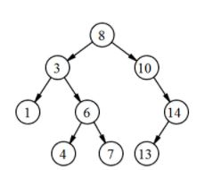

## 힙(Heap)

* 힙은 최댓값 및 최솟값을 찾아내는 연산을 빠르게 하기 위해 고안된 완전이진트리를 기본으로 한 자료구조로서 다음과 같은 힙 속성을 만족한다.
* A가 B의 부모노드이면, A의 키값과 B의 키값 사이에는 대소관계가 성립한다.
* 힙에는 두가지 종류가 있으며, 부모노드의 키값이 자식노드의 키값보다 항상 큰 힙을 '최대 힙', 부모노드의 키값이 자식노드의 키값보다 항상 작은 힙을 '최소 힙'이라고 부른다.
* 키값의 대소관계는 오로지 부모노드와 자식노드 간에만 성립하며, 특히 형제 사이에는 대소관계가 정해지지 않는다.
* 각 노드의 자식노드의 최대개수는 힙의 종류에 따라 다르지만, 대부분의 경우는 자식노드의 개수가 최대 2개인 이진 힙을 사용한다.

#### 복잡도

O(logn)

출처 : https://ko.wikipedia.org/wiki/%ED%9E%99_(%EC%9E%90%EB%A3%8C_%EA%B5%AC%EC%A1%B0)

#### 종류

* Max Heap
* Min Heap

#### 구조

힙을 저장하는 표준적이 자료구조는 배열이다.

구현을 쉽게 하기 위해서 0인덱스는 사용하지 않는다.

특정 위치의 노드 번호는 새로운 노드가 추가되어도 변하지 않는다.

##### 힙에서 부모 노드와 자식 노드의 관계

왼쪽 인덱스 = 부모인덱스 * 2

오른쪽 인덱스 = 부모인덱스 * 2 + 1

부모 인덱스 = 자식인덱스 / 2

#### 힙 삽입

1. 새로운 노드는 가장 마지막 인덱스에 삽입된다.
2. 새로운 노드는 부모노드와 비교하며 힙의 성질을 만족시킨다.

#### 힙 삭제

1. 최대 힙에서 최댓값은 루트 노드이므로 루트노드가 삭제된다. (최대 힙에서 삭제 연산은 최댓값을 삭제하는 것이다.)
2. 삭제된 루트 노드에 힙의 마지막 노드를 가져온다.
3. 힙을 재구성 한다. (더 큰 값과 교환해야 한다.)

출처 : https://gmlwjd9405.github.io/2018/05/10/data-structure-heap.html

#### 이진 힙 순회

* 전위 순회 : 뿌리 - 왼쪽 -> 오른쪽 방문

  0 - 1- 3 - 7 - 8 - 4 - 9 - 10 - 2 - 5 - 11 - 6

* 중위 순회 : 전체 왼쪽 노드들 부터 방문

  7 - 3 - 8 - 1 - 9 - 4 - 10 - 0 - 11 - 5 - 2 - 6

* 후위 순회 : 왼쪽 - 오른쪽 하위 트리 모두 방문 후 뿌리 방문

  7 - 8 - 3 - 9 - 10 - 4 - 1 - 11 - 5 - 6 - 2 - 0

